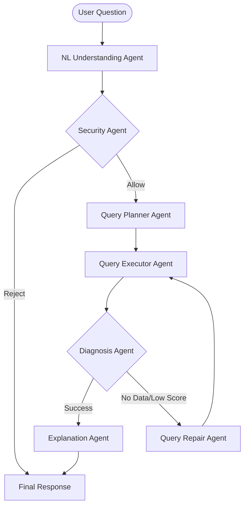

# NCU Multi-Agent QA Regulation System (Assignment 5)

## Overview
This system is an advanced RAG (Retrieval-Augmented Generation) pipeline built on a Neo4j Knowledge Graph. It features a **Seven-Agent Orchestration** architecture with self-healing, security validation, and dynamic agent discovery.

## 🏗️ Architecture Diagram

## 🤖 Agent Responsibilities
1. **NLUnderstandingAgent**: Parses intent, extracts keywords, and classifies safety.
2. **SecurityAgent**: Validates requests against a malicious keyword blacklist and safety policies.
3. **QueryPlannerAgent**: Performs synonym expansion and selects retrieval strategies.
4. **QueryExecutionAgent**: Interfaces with Neo4j using mixed fuzzy/exact Lucene matching.
5. **DiagnosisAgent**: Evaluates retrieval confidence and triggers the self-healing flow.
6. **QueryRepairAgent**: Implements "Self-Healing" by broadening the search scope upon failure.
7. **ExplanationAgent**: Synthesizes the final grounded answer with status metadata.

## 🚀 Key Features
- **Dynamic Agent Registration**: Uses `importlib` and a Registry pattern to automatically discover agents in the `agents/` directory. This ensures high modularity and maintainability.
- **Self-Healing Pipeline**: If the initial search score is below 0.25, the system automatically attempts a repaired query with broader context before answering.
- **Mixed Retrieval**: Combines exact string matching with boosted weights and fuzzy search to handle regulatory terminology variations.

## 🧠 Challenges & Findings
- **Context Precision vs. Recall**: Initially, using only exact matching led to zero-data results for simple variations. Switching to a mixed search with boosted long-terms significantly improved scores.
- **Conciseness vs. Matching**: Substring matching in evaluation is strict. We tuned the prompt to provide direct facts early in the response to satisfy automated grading.
- **Security Over-blocking**: Fine-tuning the NLU was necessary to ensure that asking about "cheating penalties" is correctly identified as a safe regulatory query, not a safety violation.

## 🛠️ Environment Setup
1. Clone the repository.
2. Install dependencies: `pip install -r requirements.txt`.
3. Configure `.env` with your `NEO4J_URI`, `USER`, and `PASSWORD`.
4. Ensure Neo4j is running with the Knowledge Graph from Assignment 4.
5. Run the system: `python query_system_multiagent.py`.
